# Legwork

[](https://pypi.org/project/legwork-mcp/)
[](https://github.com/kumarganduri/legwork/actions/workflows/ci.yml)
[](LICENSE)

**Point it at a GitHub repo, get a working MCP tool back.**

<p align="center">
  
</p>
<p align="center"><sub>Real runs, real output. The 24-second install is sped up; the malware repo's name is masked.</sub></p>

Legwork reads a repo's README, has your LLM write an
[MCP](https://modelcontextprotocol.io) wrapper for it, installs it in a
sandbox, and proves it runs before handing it to Claude Code, Cursor or any
other MCP client. If a repo can't be wrapped, it says why instead of
producing something broken.

```sh
uvx legwork-mcp owner/repo
```

## Proof, not a pitch

On 2026-09-26 we ran Legwork against **this week's 10 most-starred new AI
repos on GitHub**, taken exactly as search ranked them, with nothing skipped
for being hard:

| Outcome | Repos |
|---|---|
| ✅ Built a working MCP server | **3** — an npm CLI, a Python library, a Go binary |
| ↩️ Refused, with the right reason | **5** — two Android/macOS apps, a desktop app, a repo with no usage docs, a tool that needs its own API keys |
| 🛑 Blocked as malware | **2** |

Two of the week's top-10 "AI tools", about 700 stars each and three days
old, carried the same byte-identical obfuscated dropper under different
file names. Legwork's pre-install scan refused both in about a second.
Nothing from them was installed or run. Stars are not a trust signal.

Full write-up, including what failed along the way and what we fixed:
[docs/designs/legwork-trending-trial-2026-09-26.md](docs/designs/legwork-trending-trial-2026-09-26.md).

## Quick start

You need **macOS or Linux**, [uv](https://docs.astral.sh/uv/), and any
OpenAI-compatible chat-completions endpoint. Legwork itself is free; the
only cost is your own model usage, which is 1–3 calls per build.

<details>
<summary><b>Linux:</b> install bubblewrap (and one step on Ubuntu 24.04+)</summary>

The Linux sandbox is [bubblewrap](https://github.com/containers/bubblewrap):

```sh
sudo apt install bubblewrap python3-venv   # Debian/Ubuntu
sudo dnf install bubblewrap                # Fedora
```

Ubuntu 24.04 and later block the user namespaces bubblewrap needs, unless a
program's AppArmor profile allows them. Allow them for `bwrap` only (this
is what Ubuntu does for Chrome and Flatpak), rather than switching the
restriction off system-wide:

```sh
sudo tee /etc/apparmor.d/bwrap <<'EOF'
abi <abi/4.0>,
include <tunables/global>

profile bwrap /usr/bin/bwrap flags=(unconfined) {
  userns,
  include if exists <local/bwrap>
}
EOF
sudo apparmor_parser -r /etc/apparmor.d/bwrap
```

If anything's missing, Legwork stops and prints these instructions.
</details>

**Tested on every commit:** macOS on Apple silicon and Intel; Ubuntu on
x86-64 and ARM64; Fedora; Debian. **Windows:** not supported natively.
WSL2 should behave like Ubuntu (install bubblewrap) but hasn't been tested.

```sh
export LEGWORK_LLM_ENDPOINT=https://api.openai.com/v1
export LEGWORK_LLM_API_KEY=...        # your own key; never a CLI flag
export LEGWORK_LLM_MODEL=gpt-5

uvx legwork-mcp 2akouwu/reverify
```

A build takes 1–3 minutes and ends with the line to connect it:

```
Built an MCP wrapper for 2akouwu/reverify on attempt 2 of 3.
  What it wraps: Verify claims about binaries using Reverify's deterministic tools (wraps `reverify verify --json`)

Connect it to Claude Code:
  claude mcp add reverify -- ~/.local/bin/uvx legwork-mcp serve 2akouwu/reverify
```

It also prints an `mcpServers` block for Claude Desktop, Cursor and other
clients. For Claude Desktop, add it to `claude_desktop_config.json` **while
the app is quit**: the running app writes its settings back on exit and
drops edits it didn't make. Tested with Claude Code and Claude Desktop.
For a permanent `legwork` command: `uv tool install legwork-mcp`.

**Repos already in the [public cache](cache/) need no model call and no API
key.** `uvx legwork-mcp 2akouwu/reverify` works as is.

## Model providers

Any OpenAI-compatible chat-completions endpoint works. Put three lines in a
private file (`chmod 600`) and `source` it before building:

| Provider | `LEGWORK_LLM_ENDPOINT` | `LEGWORK_LLM_MODEL` (tested) | Cost |
|---|---|---|---|
| OpenAI | `https://api.openai.com/v1` | `gpt-5` | Your API credits |
| Anthropic | `https://api.anthropic.com/v1` | `claude-sonnet-5` | Your API credits |
| OpenRouter | `https://openrouter.ai/api/v1` | `nvidia/nemotron-3-super-120b-a12b:free` | Free models, rate-limited |
| Ollama (local) | `http://127.0.0.1:11434/v1` | `gpt-oss:20b` | Free; 14 GB download, ~16 GB RAM |

`LEGWORK_LLM_API_KEY` is your key (for Ollama, any non-empty value).

**Ollama:** start it with a larger context window, or it silently cuts
Legwork's prompt to ~2,000 tokens and the model never sees the
instructions: `OLLAMA_CONTEXT_LENGTH=32768 ollama serve`. Legwork prints
this tip when it detects Ollama.

**OpenRouter free models** come and go and are often busy (HTTP 429). If
one keeps failing, pick another from
[their list](https://openrouter.ai/models?max_price=0).

**Measured 2026-09-27**, same four repos on each (reverify, golive-skill,
AnyJev, phone-harness), counting wrappers built:

| Model | Built | Notes |
|---|---|---|
| gpt-5 | 4 / 4 | all on the first attempt |
| Nemotron 3 Super (OpenRouter, free) | 3 / 4 | |
| gpt-oss:20b (Ollama, local) | 3 / 4 | slowest: 1–3 min per reply on an M5 |
| Claude Sonnet 5 | 1 / 4 | the most cautious: refused three, citing third-party accounts, a paired iPhone, and "a research pipeline" |

A refusal isn't a crash: Legwork reports the model's reason and stops
without installing anything.

## How it works

0. **Cache.** If the repo is in the [public cache](cache/), Legwork uses
   that wrapper instead of steps 3–4. It still clones and scans the repo,
   scans the cached wrapper too, and installs and self-tests it locally;
   if the self-test fails, it writes a fresh wrapper. `--no-cache` skips
   the cache.
1. **Fetch.** Checks the repo is public and reachable, then shallow-clones it.
2. **Scan.** Statically scans every Python and JavaScript/TypeScript file
   for obfuscated payloads: XOR-decoded byte arrays, computed imports,
   javascript-obfuscator output, `eval` of decoded strings, code hidden
   off-screen behind whitespace. A hit stops everything before install.
3. **Read.** The README, plus setup docs it links to (`install.md`,
   `docs/getting-started.md`, …), capped at 50KB with install and usage
   sections kept first.
4. **Write.** Your model writes the install command and a Python MCP
   wrapper with a self-test, or refuses with a specific reason: no
   programmatic entrypoint, needs hardware, needs its own credentials,
   needs a toolchain the sandbox doesn't have, and so on.
5. **Install**, sandboxed, network on.
6. **Self-test**, sandboxed, network off. A failure goes back to the model
   and it tries again, up to 3 attempts and 30 minutes. Attempts share one download cache, so a retry doesn't re-download multi-GB dependencies like PyTorch.
7. **Serve.** `legwork serve owner/repo` runs the wrapper as an MCP server
   over stdio, sandboxed, network off.

## What "built" means

The self-test calls the **simplest** documented command and checks the
shape of its result. So "built" means the wrapper starts and its simplest
tool works. It does not mean every tool works. In the trial:

- golive-skill's wrapper exposes its read-only commands, not its deploy
  flow, which needs accounts.
- AnyJev's decision tool needs a running vLLM server, which the self-test
  didn't have.

Tools that must reach the network at run time won't work under `serve`,
because the network is off.

## Risks, stated plainly

Legwork runs code you didn't write: the target repo's install steps and a
wrapper an LLM wrote from a README a stranger wrote. What contains it:

- **Install time is the biggest risk.** Package installs and `install.sh`
  scripts run with network on, because they have to. The sandbox limits
  them to their own working folder: no access to your home directory (SSH
  keys, cloud credentials, dotfiles), no writes outside the folder, and an
  environment with none of your variables (including your model key). A
  malicious package can still misbehave inside that folder and reach the
  network during install.
- **The scan covers the repo's source, not what installers download.**
  magpie, for example, installs with the vendor's `curl … | sh`. For
  downloaded code, the sandbox is the protection.
- **Prompt injection is not mitigated.** A README can steer the model into
  writing a wrapper that does something other than what you asked for. The
  wrapper still runs sandboxed with network off, which bounds the damage;
  it doesn't prevent a wrong or misleading tool.
- **Linux on architectures other than x86-64 and ARM64:** install code
  can reach "abstract" Unix sockets (such as an X11 display), because the
  seccomp filter that blocks Unix sockets during install only covers those
  two. The run phase has no network and isn't affected.
- **The scanner is heuristic.** It catches the obfuscation patterns seen in
  real payloads so far, and a determined author can get past it.

The sandbox is `sandbox-exec` on macOS and bubblewrap on Linux, with the
same rules on both: the system read-only, your home directory hidden,
writes only in the build's own folder, no local sockets (SSH agent, Docker,
display servers), only the system services builds need, and network only
during install. If the sandbox isn't available, Legwork
refuses to run. It never falls back to running unsandboxed.

## Commands

| Command | What it does |
|---|---|
| `legwork owner/repo` | Build a wrapper (also `legwork build`), from the cache when possible. Accepts `owner/repo` or a github.com URL. `--no-cache` always writes a fresh one |
| `legwork serve owner/repo` | Run the built wrapper as an MCP server over stdio. Needs no model key |
| `legwork contribute owner/repo [--out DIR]` | Write the build as a public-cache entry, ready for a PR (below) |
| `legwork clean [owner/repo]` | Free disk space: remove old and failed builds, keep the ones you serve. `--dry-run`, `--all` |

Builds live in `~/.legwork` (override with `LEGWORK_HOME`). A failed build
saves its full error output to `attempts.log` in its build folder. Each
build keeps its own environment, which is several GB for repos that use
PyTorch: `legwork clean` removes old and failed builds and keeps the ones
you serve (`--dry-run` to preview, `--all` to remove everything).

## Contributing a wrapper

`legwork contribute owner/repo` writes `cache/<owner>__<repo>/` containing
`wrapper.py` and `manifest.json`, and prints a PR description. Before
writing anything, it:

- blocks the entry if the wrapper copies 50+ words in a row from the source repo
- re-runs the self-test in the sandbox
- blocks the write if any output contains something shaped like an API key,
  including your own configured key

A GPL, AGPL, missing or unrecognized source license is flagged in the
manifest and the PR description, but not blocked. If the repo has commits
newer than the build or the existing entry, you get a warning. Open the PR
yourself; a bad entry is removed with a plain `git revert`.

## Status

Early. What's next:

- Better multi-tool verification than a single simplest-command self-test.

## Development

See [CONTRIBUTING.md](CONTRIBUTING.md). Security reports: [SECURITY.md](SECURITY.md).

```sh
uv sync
uv run pytest        # sandbox tests need macOS, or Linux with bubblewrap
```

`tests/fixtures/ai_data_extractor_payload.py` is a real malicious file with
its payload destroyed (every encoded byte randomized, code shape kept), so
the scanner is tested against a real technique. Tests only parse it with
`ast`; see `tests/fixtures/README.md`.

## License

MIT
